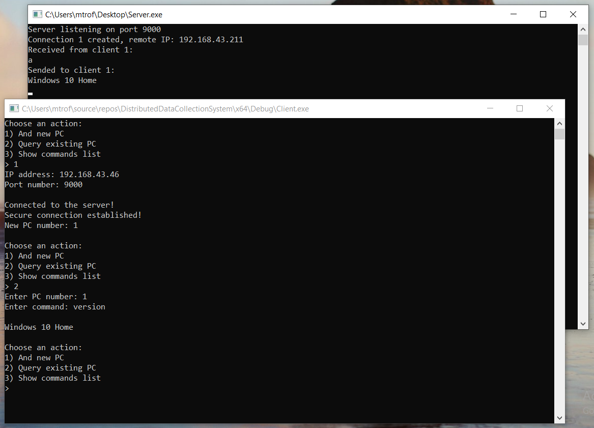

# DistributedDataCollectionSystem
## Распределенная система для сбора информации о компьютерах

Поддерживает множество активных подключений

Данные между узлами передаются в зашифрованном виде

Поддерживается сбор следующей информации:
1. версия ОС
2. текущее время на ПК
3. время, прошедшее с момента запуска
4. статистика использования оперативной памяти
5. свободное место на дисках
6. права и владелец файла/директории

Пример получения версии ОС:

Пример получения информации о файле:

